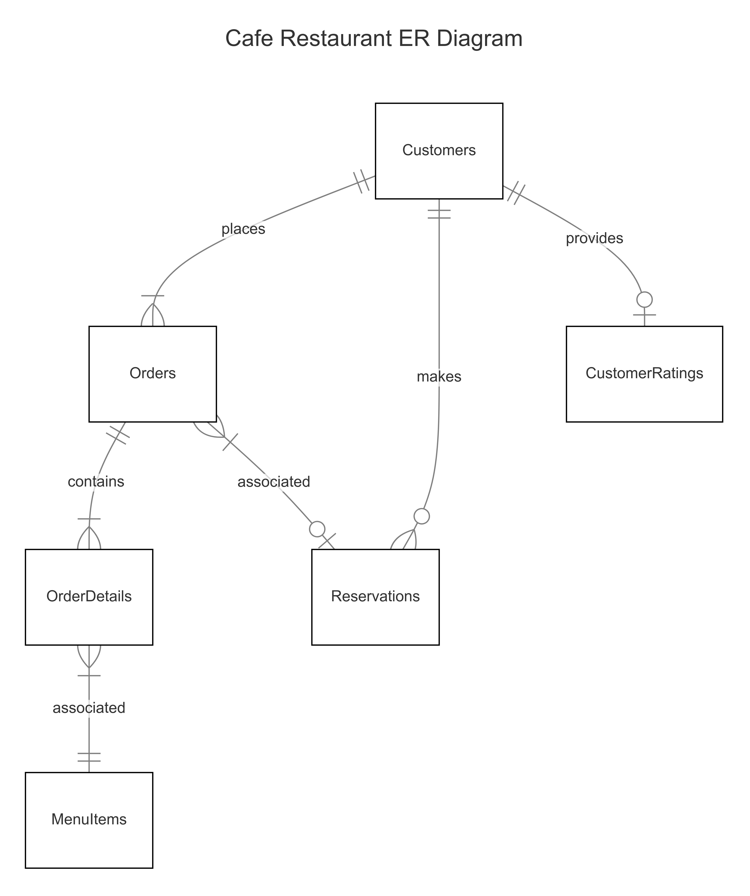

# Cafe-Restaurant-Orders-and-Management-System

By Ankit AKash Kalita

Video overview: <https://youtu.be/lzA0hE7zXtE?si=g2hEjpDazevhxQee>

## Scope

The database for the "Cafe Restaurant Customer Orders and Management System" includes all entities necessary to manage customer interactions, track orders, and provide a comprehensive view of customer activity. As such, included in the database's scope is:

* Customers: Captures essential customer information, including name and contact details.
* Menu Items: Contains details about the items available in the cafe, including descriptions, categories, pricing, and availability status.
* Orders: Tracks orders placed by customers, including order type, payment status, payment method, and the total amount of each order.
* Order Details: Records the specifics of each order, such as the items ordered, their quantities, and the total price for each item.
* Reservations: Includes details on the customer making the reservation, the date and time of the reservation, and the number of guests.
* Customer Ratings: Stores customer feedback, including ratings and reviews.

Out of scope are elements like employee management, supplier information, inventory tracking, and advanced financial reporting.

## Functional Requirements

This database will support:
* CRUD Operations: Create, read, update, and delete records for customers, menu items, orders, order details, reservations, and customer ratings.
* Order Tracking: Track customer orders, including details about the items ordered and the status of payments.
* Data Summarization: View summarized data such as daily sales, pending orders, and detailed order summaries through various predefined views.

Beyond the scope of this database are:
* Employee management: The database does not handle staff or employee information.
* Supplier and inventory tracking: Supplier details and inventory management are not included.
* Advanced financial reporting: Detailed financial analysis beyond basic sales summaries is not supported.

## Representation

Entities are captured in SQLite tables with the following schema.

### Entities

The database includes the following entities:

#### Customers

The `Customers` table stores essential information about each customer, s, allowing for customer identification and relationship management.

The `Customers` table includes:

* `id`, which specifies the unique ID for the customer as an `INTEGER`. This column is the `PRIMARY KEY` to uniquely identify each customer.
* `first_name`, which specifies the customer's first name as `TEXT`, since names are best represented with textual data.
* `middle_name`, which specifies the customer's middle name as `TEXT`, with a `DEFAULT NULL` constraint since not all customers may have a middle name.
* `last_name`, which specifies the customer's last name as `TEXT`, similar to `first_name`.
* `phone_no`, which specifies the customer's phone number as `TEXT`. This type is chosen to accommodate various phone number formats and international variations, as phone numbers can include special characters, spaces, or country codes. The `UNIQUE` constraint ensures no two customers share the same phone number.
`email_id`, which specifies the customer's email address as `TEXT`. The `UNIQUE` constraint is applied to ensure each email is associated with only one customer, and it can be `NULL` if the customer chooses not to provide an email.

#### MenuItems

The MenuItems table holds details about each menu item, including its description, category, pricing, and availability, enabling the restaurant to manage and present its offerings.

The `MenuItems` table includes:

* `id`, which specifies the unique ID for the menu item as an `INTEGER`. This column is the `PRIMARY KEY` to uniquely identify each item.
* `item_name`, which specifies the name of the menu item as `TEXT` since names are best represented as text.
* `description`, which specifies a description of the menu item as `TEXT` to provide details about the item.
* `category`, which specifies the category of the menu item as `TEXT` with a `CHECK` constraint to limit to predefined categories. The `CHECK` constraint ensures the value is one of the predefined categories like 'Starters', 'Main Courses', etc., for consistent categorization.
* `diet_type`, which specifies the dietary type as `TEXT` with a `CHECK` constraint for predefined values. The `CHECK` constraint ensures it is either 'Veg', 'Non-Veg', or 'Not Applicable', with a `DEFAULT` value of 'Not Applicable' to handle cases where this attribute is not relevant.
* `unit_price`, which specifies the price per unit of the menu item as `REAL`. This type is chosen to allow for decimal precision in pricing.
* `availability_status`, which specifies whether the menu item is available as `TEXT` with a `CHECK` constraint for predefined values. The `CHECK` constraint ensures it is either 'Available' or 'Not Available', with 'Available' set as the `DEFAULT` to assume availability unless specified otherwise.

#### Orders

The Orders table records information about customer orders, including the order type, payment status, and total amount, facilitating order processing and payment tracking.

The `Orders` table includes:

* `id`, which specifies the unique ID for the order as an `INTEGER`. This column is the `PRIMARY KEY` to uniquely identify each order.
* `customer_id`, which specifies the ID of the customer who placed the order as an `INTEGER`. It is a `FOREIGN KEY` that references the `Customers` table, ensuring the order is associated with an existing customer.
* `reservation_id`, which specifies the ID of the reservation linked to the order as an `INTEGER`. It is a `FOREIGN KEY` that references the `Reservations` table and can be `NULL` if the order is not associated with a reservation.
* `order_type`, which specifies the type of order as `TEXT` with a `CHECK` constraint. The `CHECK` constraint ensures it is either 'Dine-in', 'Takeaway', or 'Delivery' to standardize order types.
* `order_datetime`, which specifies the date and time the order was placed as `DATETIME`. The `DEFAULT` constraint is set to `CURRENT_TIMESTAMP` to automatically record the time of order creation.
* `total_amount`, which specifies the total amount of the order as `REAL` to allow for decimal precision in the order total.
* `payment_status`, which specifies whether the payment for the order is 'Paid' or 'Pending' as `TEXT`. A `CHECK` constraint is applied for consistency.
* `payment_method`, which specifies the method of payment as `TEXT` with a `CHECK` constraint. The `CHECK` constraint ensures it is one of 'Cash', 'Card', or 'UPI', representing common and acceptable payment methods.

#### OrderDetails

The `OrderDetails` table captures the specifics of each order, such as the items ordered and their quantities, allowing for detailed tracking of order contents.

The `OrderDetails` table includes:

* `order_id`, which specifies the ID of the order as an `INTEGER`. This is a `PRIMARY KEY` column that, combined with `menu_item_id`, uniquely identifies each order detail. It is also a `FOREIGN KEY` referencing the `Orders` table.
* `menu_item_id`, which specifies the ID of the menu item as an `INTEGER`. This is part of the `PRIMARY KEY` and is also a `FOREIGN KEY` referencing the `MenuItems` table.
* `quantity`, which specifies the quantity of the menu item ordered as an `INTEGER` to indicate how many units were ordered.
* `total_price`, which specifies the total price for the ordered quantity of the menu item as `REAL` to allow for decimal precision.

#### Reservations

The Reservations table manages customer reservations, including the date, time, and number of guests, enabling the restaurant to organize and plan for guest seating.

The `Reservations` table includes:

* `id`, which specifies the unique ID for the reservation as an `INTEGER`. This column is the `PRIMARY KEY` to uniquely identify each reservation.
* `customer_id`, which specifies the ID of the customer who made the reservation as an `INTEGER`. It is a `FOREIGN KEY` referencing the `Customers` table.
* `reservation_datetime`, which specifies the date and time of the reservation as `DATETIME` to accurately capture when the reservation is scheduled.
* `number_of_guests`, which specifies the number of guests for the reservation as an `INTEGER` to record how many people the reservation is for.

#### CustomerRatings

The `CustomerRatings` table stores customer feedback, including ratings and reviews, helping the restaurant assess customer satisfaction and improve service quality.

The `CustomerRatings` table includes:

* `id`, which specifies the unique ID for the rating as an `INTEGER`. This column is the `PRIMARY KEY` to uniquely identify each rating.
* `customer_id`, which specifies the ID of the customer providing the rating as an `INTEGER`. It is a `UNIQUE` column and a `FOREIGN KEY` referencing the `Customers` table, ensuring each customer can provide only one rating.
* `rating`, which specifies the rating given by the customer as an `INTEGER` with a `CHECK` constraint. The `CHECK` constraint ensures the rating is between 1 and 5, reflecting a typical rating scale.
* `review`, which specifies any additional comments or feedback from the customer as `TEXT`, with a `DEFAULT NULL` constraint since reviews are optional.

### Relationships

The below entity relationship diagram describes the relationships among the entities in the database.

As detailed by the diagram:

* One customer can place one or many orders, one if they place a single order, and many if they have placed multiple orders. Each order is associated with one and only one customer, ensuring that every order is linked to a specific customer.
* One customer can make zero or many reservations, zero if they have not made any reservations, and many if they have made multiple reservations. Each reservation is associated with one and only one customer, meaning that each reservation is tied to a specific customer.
* One customer can provide zero or one rating, zero if they do not choose to provide a rating, and one if they decide to give feedback. A rating is given by one and only one customer, ensuring that each rating is linked to a specific customer.
* One order can have one or many order details, one if it includes at least one item, and many if it has multiple items. Each order detail is associated with one and only one order, linking each detail to a specific order.
* One order can be linked to zero or one reservation, zero if the order is not associated with any reservation, and one if it is linked to a reservation. Each reservation can be associated with one or many orders, one if a single order is placed under that reservation, and many if multiple orders are placed under the same reservation, allowing a single reservation to cover multiple orders.
* One menu item can be part of one or many order details, one if it is included in an order, and many if it appears in multiple orders. Each order detail is associated with one and only one menu item, ensuring that each detail specifies a particular item ordered.

## Optimizations

Per the typical queries in queries.sql, it is common for users of the database to retrieve customer orders, menu items information, reservations, order summaries, and sales data.

For this purpose, several views, indexes, and a trigger have been created to optimize data retrieval and improve query performance.

### Views

To enhance query performance and simplify data retrieval, several views have been created within the database. These views are designed to aggregate and present data in a way that aligns with common reporting and analytical needs.

The following views have been implemented:

* CustomerOrders: Represents orders made by each customer, including order details and payment status. This view provides a quick overview of customer transactions.
* ReservationDetails: Provides a comprehensive view of all reservations along with customer details, facilitating easy access to reservation information.
* OrderDetailsSummary: Summarizes order details for each order, including item names, quantities, and total prices. This view allows for rapid retrieval of detailed order information.
* DailySalesSummary: Offers a summary of daily sales, including total orders and revenue generated. This view is essential for tracking sales performance on a daily basis.
* PendingOrders: Displays all pending orders, including customer details and payment methods, enabling efficient management of outstanding payments.

### Indexes

To further optimize the performance of frequent queries and ensure faster data retrieval, several indexes have been created. These indexes are strategically designed to enhance the speed of common search operations, thereby improving overall database efficiency.

The following indexes have been implemented:

* idx_customer_name: An index on the Customers table covering the first_name, middle_name, and last_name columns. This index is useful for quickly searching and sorting customers by their names.
* idx_orders_customer_id: An index on the Orders table for the customer_id column. This index optimizes queries that involve fetching orders associated with specific customers.
* idx_order_details_order_id: An index on the OrderDetails table for the order_id column. This index enhances the speed of retrieving all details related to a specific order.
* idx_order_details_menu_item_id: An index on the OrderDetails table for the menu_item_id column. This index is beneficial for queries that involve searching for order details by specific menu items.
* idx_reservations_customer_id: An index on the Reservations table for the customer_id column. This index accelerates queries that involve finding reservations made by specific customers.

### Triggers

To maintain data integrity and ensure consistency within the database, a trigger has been created to automatically handle the deletion of related records.

The following trigger has been implemented:

* delete_order_details_after_order_deletion: This trigger is executed after an order is deleted from the Orders table. It automatically deletes all records from the OrderDetails table where the order_id matches the deleted order's ID.

## Limitations

The database primarily focuses on basic customer orders, menu management, and reservations without addressing more complex operational needs such as tracking inventory levels for menu items, handling multiple payment transactions for a single order, or managing customer loyalty programs.These limitations suggest that while the database is effective for basic operations, it may require modifications to support more advanced functionalities in a growing or complex restaurant environment.
